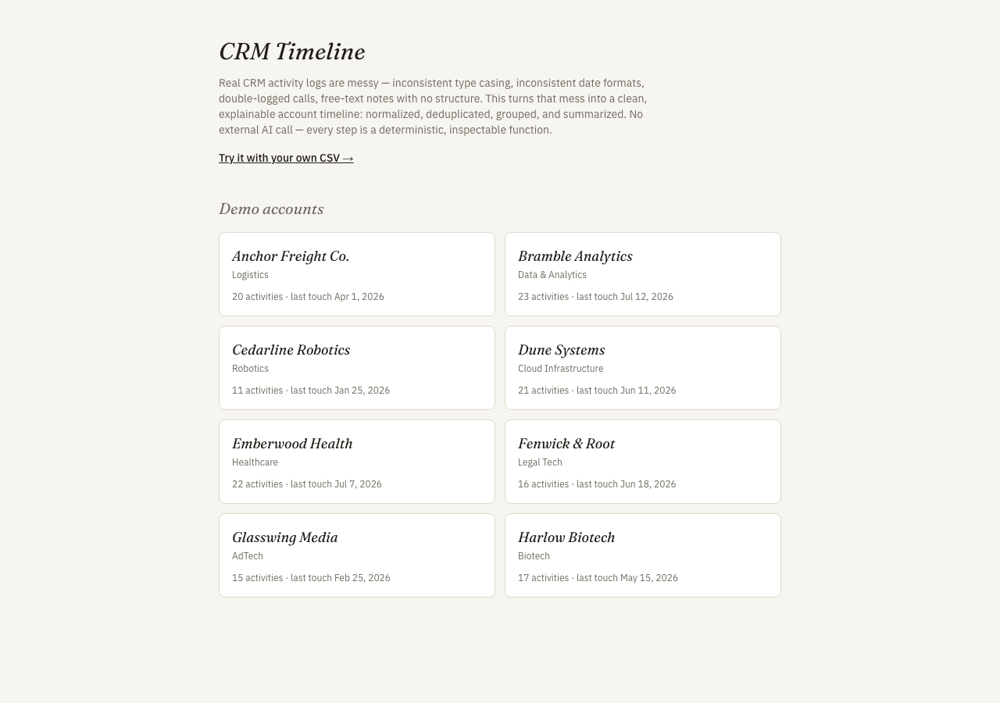
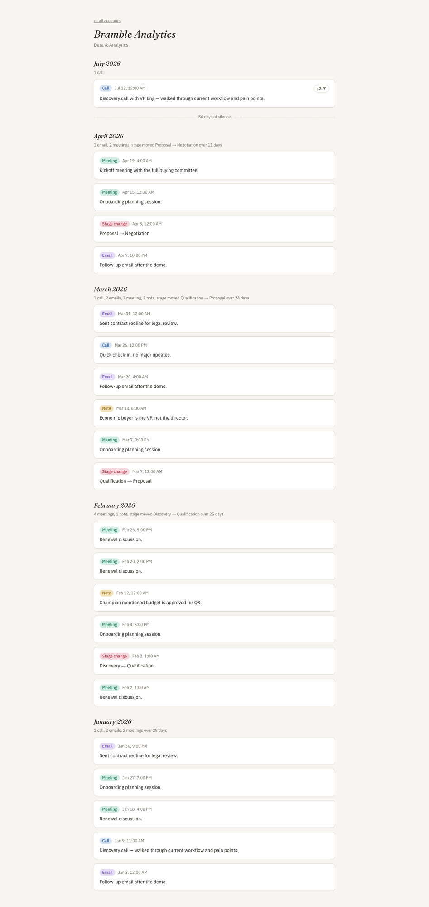
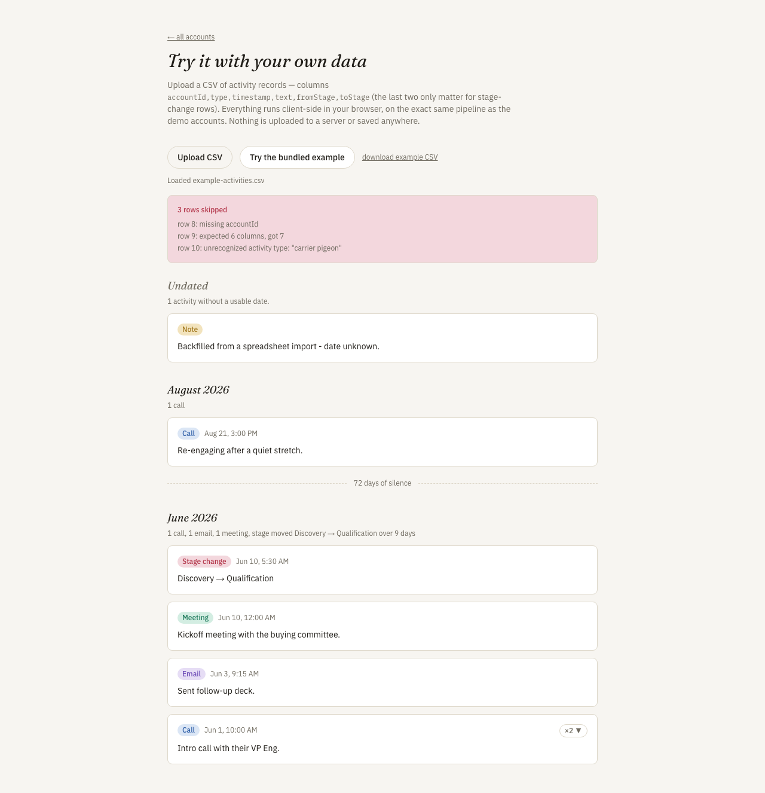

# CRM Timeline

A visual account timeline built from messy CRM activity records.

[Live Demo](https://crm-timeline-gules.vercel.app)

## Why I Built This

Real CRM activity logs are messy: inconsistent type casing ("call" / "Call" / "Phone Call"),
inconsistent date formats, duplicate entries from double-logging, and free-text notes with no
structure. A rep or manager looking at raw activity rows can't quickly see the shape of engagement
with an account — when it was hot, when it went quiet, what actually happened. Day 025 of a
100-day building challenge — this one turns that mess into a clean, explainable account timeline.

## What It Does

Land on the account list, see eight demo accounts each with a raw activity count and last-touch
date. Click into any account and see its timeline: activities normalized, deduplicated, grouped by
month, and summarized — newest first, with dedup badges and gap markers for 14+ day silences, all
inspectable by expanding a card. Or go to **Try it** and upload your own CSV of activity records —
the exact same pipeline runs client-side in your browser, nothing is uploaded anywhere, and every
skipped row is reported with a reason instead of failing the whole file.

## Demo

**Account list** — raw engagement volume and last touch per account:



**Timeline detail** (Bramble Analytics) — deduped call cluster (`×2`, expandable) and an 84-day
gap marker:



**Try it with your own CSV** — the bundled example deliberately includes a duplicate pair, a row
missing `accountId`, a row with the wrong column count, and an unrecognized activity type. All
three bad rows are skipped and reported by line number, not silently dropped or fatal:



## How It Works

1. **Normalize** — canonicalize messy type strings ("CALL", "Phone Call" → `call`), parse five
   timestamp formats (ISO 8601, date-only, epoch ms, US slash, EU dash), clean free text. An
   unparseable timestamp degrades to `null` (undated) rather than rejecting the row.
2. **Dedupe** — two activities merge when they share an account, a type, timestamps within 5
   minutes, and content similarity ≥ 0.8 (token-overlap on free text; exact stage-transition match
   for `stage_change` rows, which carry no prose). Merges are always inspectable — expand the `×N`
   badge to see the originals.
3. **Group** — deduped clusters bucket into calendar months. A month with zero activity produces
   no group at all, so a multi-month silence collapses onto the next real group's single gap value
   (only shown when ≥ 14 days).
4. **Summarize** — a deterministic templated one-liner per month group, e.g. *"2 calls, 2 emails,
   stage moved Discovery → Proposal over 12 days."* No external API call.

The same four-step pipeline (`lib/pipeline.ts`) runs identically over the committed demo corpus
(server-rendered) and an uploaded CSV (client-side) — it's a pure, synchronous function, so there's
nothing to keep in sync between the two paths.

## Architecture

```
app/
  page.tsx                    account list
  accounts/[id]/page.tsx      timeline detail (demo corpus, statically generated)
  try-it/page.tsx             CSV upload → same pipeline, client-side, ephemeral
  components/                 Timeline, ClusterCard, GapMarker, AccountCard, CsvUploadForm
lib/
  types.ts                    zod schemas: RawActivity, NormalizedActivity, Account
  normalize/                  type canonicalization, multi-format timestamp parsing, text cleanup
  dedupe/                     near-duplicate clustering
  group/                      month buckets + gap markers
  summarize/                  deterministic one-liners
  csv/                        RFC4180-ish parser + per-row validation
  pipeline.ts                 orchestrates normalize -> dedupe -> group -> summarize
data/
  generate.ts                 seeded corpus generator (the planted messiness lives here)
  corpus/*.json                committed output of `npm run corpus` — the app never generates at runtime
```

No database, no server-side API route, no external AI dependency. The demo corpus is generated
once, committed, and imported directly; a CSV upload never leaves the browser.

## Key Decisions & Tradeoffs

- **Decision:** Deterministic templated summaries, not an LLM call.
  **Why:** Earlier days in this challenge (010–015) used an optional Gemini call; days 016–021
  moved away from it entirely. Staying deterministic keeps this repo runnable by anyone with zero
  credentials and zero API cost, and the counts/stage-movement/span are genuinely all the summary
  needs.
  **Tradeoff:** The one-liners are mechanical, not prose — no synthesis of *why* an account went
  quiet, just what and when.

- **Decision:** Dedup requires an exact stage-transition match for `stage_change` rows instead of
  text similarity.
  **Why:** Stage-change rows carry empty free text — their content is the transition, not prose —
  so token-overlap similarity would be meaningless (or worse, would falsely match two unrelated
  stage changes that both happen to have empty text).
  **Tradeoff:** A `stage_change` row can never partially match; it's exact-or-nothing.

- **Decision:** CSV upload is client-side only, no persistence.
  **Why:** Matches the challenge's own build discipline (real credentials/data don't belong in a
  committed demo) and keeps the try-it flow honest — nothing you upload leaves your browser.
  **Tradeoff:** No saved/shareable link for an uploaded timeline; reload and it's gone.

## Getting Started

### Prerequisites

Node.js 20+, npm.

### Installation

```bash
git clone https://github.com/akshatiwarix/crm-timeline.git
cd crm-timeline
npm install
```

### Run Locally

```bash
npm run dev
```

Open http://localhost:3000.

## Usage

- Browse the eight demo accounts from the home page.
- Or go to **/try-it**, click **Try the bundled example** (or upload your own CSV with columns
  `accountId,type,timestamp,text,fromStage,toStage` — the last two only matter for
  `stage_change` rows).
- To regenerate the demo corpus after editing `data/generate.ts`: `npm run corpus`.

## Validation / Testing

98 Vitest unit and integration tests (`npm test`) covering every pure `lib/` module against both
well-formed and deliberately messy inputs, plus generator invariant checks (every demo account has
activity, the three planted signatures — a duplicate pair, a 45-day silence, an unparseable
timestamp — are actually present) and full-pipeline integration tests that run the real committed
corpus through normalize → dedupe → group → summarize and assert the planted behaviors surface
end-to-end. Manually verified live: built, started the production server, and used a headless
browser to walk every route (account list, all eight timelines, 404 case, CSV upload with the
bundled example) — which is how the row-numbering bug documented in the commit history was
actually caught.

## Limitations

- The CSV parser doesn't attempt BOM stripping or malformed-encoding recovery — a plain UTF-8 CSV
  with a header row is assumed.
- The US-slash-vs-EU-dash timestamp disambiguation is a fixed assumption (slash = `MM/DD/YYYY`,
  dash = `DD-MM-YYYY`); a file mixing both conventions under the same delimiter isn't detectable.
- No persistence — an uploaded CSV's timeline can't be saved, shared, or revisited after a reload.
- Eight demo accounts and ~145 activities; not tested against corpora orders of magnitude larger.

## What I'd Build Next

- Real CRM OAuth import (Salesforce/HubSpot) instead of CSV upload.
- Cross-account rollup / territory-level activity view.
- Saved/shareable timelines for uploaded data (would require persistence).

## License

MIT — see [LICENSE](LICENSE).
